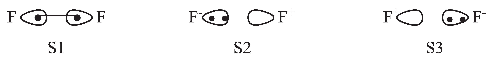

BDE and RE of F2
==================

.. _Introduction:

Introduction
------------

F2 is a typical diatimic molecule which is simple enough for the users as a starting point.
There is only 1 chemical bonding in the molecule. The 3 structures of the bonding is shown below.

   Structures of F2 molecule

Here ``S1`` denotes the covalent structure in which two active electrons are shared between both F atoms while ``S2`` and 
``S3`` denote 2 quivalent ionic structures in which two active eletrons doubly occupy orbital on certain F atom.

Computations at Stationary Point
---------------------------------

The computations are proceeded with F-F bond length 1.4 Angstrom, and the basis set is cc-pVDZ. For simplicity, F atoms are located in the *Z* axis.

Here shows the XMVB input file for all 3 structures at stationary point:

.. code-block:: console

  F2 VBSCF with 3 structures
  $CTRL
  STR=FULL NAO=2 NAE=2 ISCF=5 IPRINT=3
  ORBTYP=HAO FRGTYP=SAO
  INT=LIBCINT BASIS=CC-PVDZ
  $END
  $FRAG
  1*6
  SPZDXXDYYDZZ 1
  SPZDXXDYYDZZ 2
  PXDXZ 1
  PXDXZ 2
  PYDYZ 1
  PYDYZ 2
  $END
  $ORB
  1*10
  1
  2
  1
  2
  3
  4
  5
  6
  1
  2
  $END
  $GEO
  F 0.0 0.0 0.0
  F 0.0 0.0 1.4
  $END

Results
--------

The computational energies are listed in following table.

.. csv-table:: Computational results
   :header: "Method","W1","W2","W3"
   :widths: 25,25,25,25

   "VBSCF","0.8","0.1","0.1"
   "BOVB","0.7","0.15","0.15"

